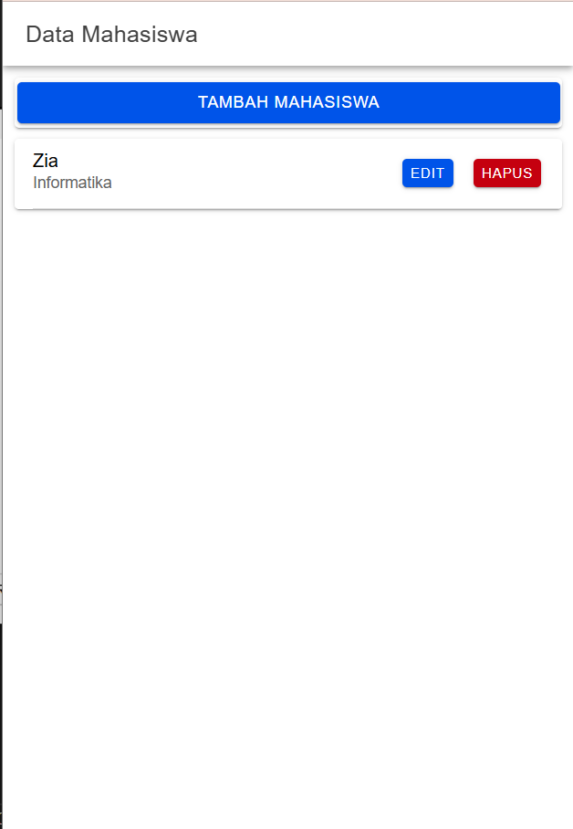
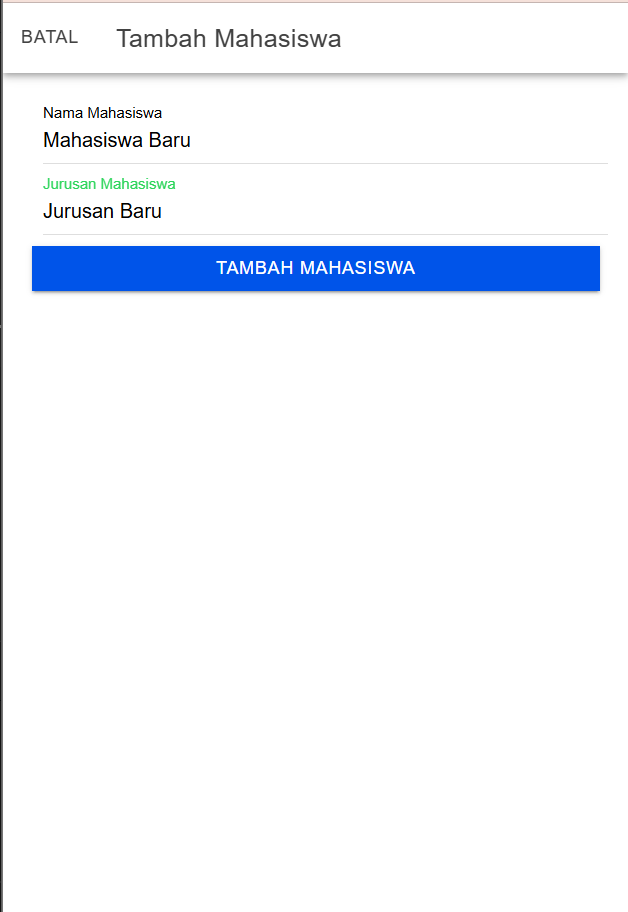
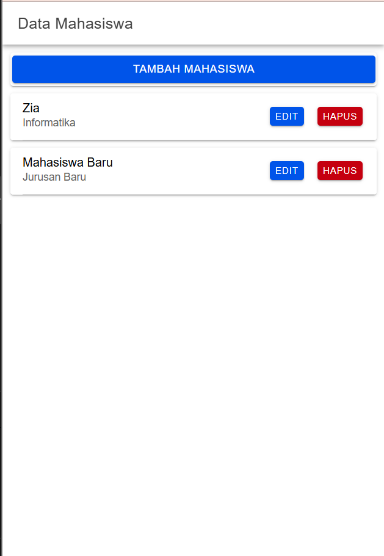
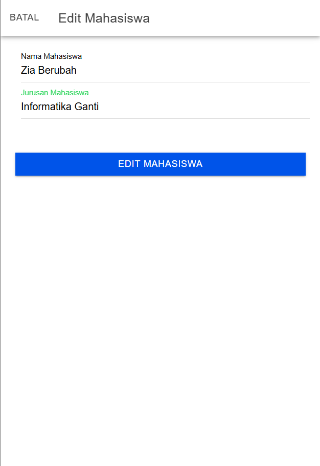
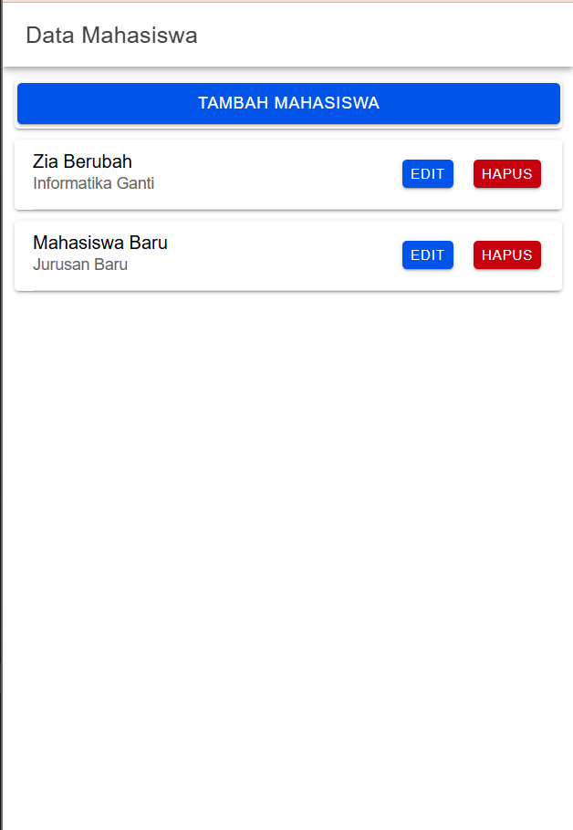
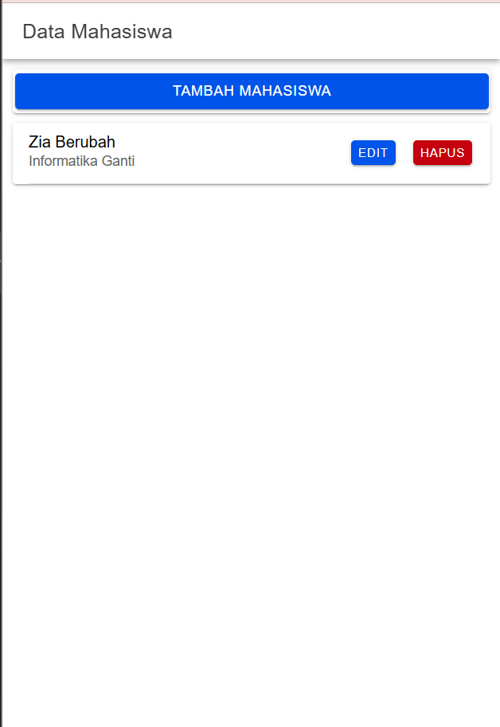

# Tugas 8
Nama       : Zia Khusnul Fauzi Akhmad

NIM        : H1D022023

Shift Baru : Shift D

Ini adalah aplikasi CRUD yang dibangun menggunakan Angular dan Ionic. Berikut adalah bagian-bagian penting dari kode dalam proyek ini.

## Screenshot
### Halaman Tampil


#### Kode Utama
``` typescript
  getMahasiswa() {
    this.api.tampil('tampil.php').subscribe({
      next: (res: any) => {
        console.log('sukses', res);
        this.dataMahasiswa = res;
      },
      error: (err: any) => {
        console.log(err);
      },
    });
  }
```
Fungsi getMahasiswa() digunakan untuk mengambil data mahasiswa dari server melalui API. Fungsi ini dipanggil saat data mahasiswa perlu dimuat, misalnya saat halaman pertama kali diinisialisasi.

this.api.tampil('tampil.php') memanggil metode tampil dari ApiService, yang akan membuat permintaan HTTP ke endpoint tampil.php di server.
Endpoint ini diharapkan mengembalikan data mahasiswa dalam format JSON.

Fungsi tampil() mengembalikan sebuah Observable. Untuk menerima hasil dari Observable, subscribe() dipanggil.
subscribe memiliki dua parameter utama:
next: Menangani respons sukses dari server.
error: Menangani respons jika terjadi kesalahan.

Ketika respons diterima dengan sukses, callback next akan dijalankan.
Pada callback ini:
res adalah data mahasiswa yang dikembalikan oleh server.
console.log('sukses', res); digunakan untuk mencetak pesan sukses dan menampilkan data mahasiswa di konsol untuk tujuan debugging.
this.dataMahasiswa = res; menyimpan data mahasiswa ke variabel dataMahasiswa di dalam komponen. Variabel ini kemudian akan digunakan di template untuk menampilkan data di halaman.

Jika terjadi kesalahan saat mengambil data, callback error akan dijalankan.
console.log(err); mencetak pesan error di konsol, yang dapat membantu dalam mendeteksi masalah atau bug pada saat pengambilan data.

### Halaman Tambah


#### Setelah Menambahkan Data


#### Kode Utama
``` typescript
  tambahMahasiswa() {
    if (this.nama != '' && this.jurusan != '') {
      let data = {
        nama: this.nama,
        jurusan: this.jurusan,
      }
      this.api.tambah(data, 'tambah.php')
        .subscribe({
          next: (hasil: any) => {
            this.resetModal();
            console.log('berhasil tambah mahasiswa');
            this.getMahasiswa();
            this.modalTambah = false;
            this.modal.dismiss();
          },
          error: (err: any) => {
            console.log('gagal tambah mahasiswa');
          }
        })
    } else {
      console.log('gagal tambah mahasiswa karena masih ada data yg kosong');
    }
  }
```

Fungsi tambahMahasiswa() digunakan untuk menambahkan data mahasiswa baru ke server melalui API. Fungsi ini dipanggil saat tombol "Tambah" ditekan pada halaman tambah.

if (this.nama != '' && this.jurusan != '') memeriksa apakah input nama dan jurusan tidak kosong. Jika kosong, fungsi akan menghentikan eksekusi dan mencetak pesan error di konsol.

let data = { nama: this.nama, jurusan: this.jurusan, } membuat objek data yang berisi nama dan jurusan yang akan ditambahkan.

this.api.tambah(data, 'tambah.php') memanggil metode tambah dari ApiService, yang akan membuat permintaan HTTP POST ke endpoint tambah.php di server.

Fungsi tambah() mengembalikan sebuah Observable. Untuk menerima hasil dari Observable, subscribe() dipanggil.

Callback next akan dijalankan jika permintaan berhasil.
Dalam Callback ini:
this.resetModal(); membersihkan input pada modal tambah.
Pesan 'berhasil tambah mahasiswa' dicetak di konsol.
this.getMahasiswa(); memuat ulang data mahasiswa setelah penambahan data.
this.modalTambah = false; menutup modal tambah.
this.modal.dismiss(); menutup modal tambah.

Callback error akan dijalankan jika terjadi kesalahan saat menambahkan data.

### Halaman Edit


#### Setelah Mengedit Data


#### Kode Utama
``` typescript
  editMahasiswa() {
    let data = {
      id: this.id,
      nama: this.nama,
      jurusan: this.jurusan
    }
    this.api.edit(data, 'edit.php')
      .subscribe({
        next: (hasil: any) => {
          console.log(hasil);
          this.resetModal();
          this.getMahasiswa();
          console.log('berhasil edit Mahasiswa');
          this.modalEdit = false;
          this.modal.dismiss();
        },
        error: (err: any) => {
          console.log('gagal edit Mahasiswa');
        }
      })
  }
```

Fungsi editMahasiswa() digunakan untuk mengedit data mahasiswa yang sudah ada di server melalui API. Fungsi ini dipanggil saat tombol "Edit" ditekan pada halaman edit.

let data = { id: this.id, nama: this.nama, jurusan: this.jurusan } membuat objek data yang berisi id, nama, dan jurusan yang akan diubah.

this.api.edit(data, 'edit.php') memanggil metode edit dari ApiService, yang akan membuat permintaan HTTP POST ke endpoint edit.php di server.

Fungsi edit() mengembalikan sebuah Observable. Untuk menerima hasil dari Observable, subscribe() dipanggil.

Callback next akan dijalankan jika permintaan berhasil.
Dalam Callback ini:
console.log(hasil); mencetak hasil respons dari server di konsol.
this.resetModal(); membersihkan input pada modal edit.
this.getMahasiswa(); memuat ulang data mahasiswa setelah pengeditan data.
Pesan 'berhasil edit Mahasiswa' dicetak di konsol.
this.modalEdit = false; menutup modal edit.

Callback error akan dijalankan jika terjadi kesalahan saat mengedit data.


### Hapus
#### Setelah Menghapus Data


#### Kode Utama
``` typescript
  hapusMahasiswa(id: any) {
    this.api.hapus(id, 'hapus.php')
      .subscribe({
        next: (hasil: any) => {
          console.log(hasil);
          this.getMahasiswa();
          console.log('berhasil hapus Mahasiswa');
        },
        error: (err: any) => {
          console.log('gagal hapus Mahasiswa');
        }
      })
  }
```

Fungsi hapusMahasiswa(id: any) digunakan untuk menghapus data mahasiswa dari server melalui API. Fungsi ini dipanggil saat tombol "Hapus" ditekan pada halaman tampil.

this.api.hapus(id, 'hapus.php') memanggil metode hapus dari ApiService, yang akan membuat permintaan HTTP POST ke endpoint hapus.php di server.

Fungsi hapus() mengembalikan sebuah Observable. Untuk menerima hasil dari Observable, subscribe() dipanggil.

Callback next akan dijalankan jika permintaan berhasil.
Dalam Callback ini:
console.log(hasil); mencetak hasil respons dari server di konsol.
this.getMahasiswa(); memuat ulang data mahasiswa setelah penghapusan data.
Pesan 'berhasil hapus Mahasiswa' dicetak di konsol.

Callback error akan dijalankan jika terjadi kesalahan saat menghapus data.

